<!-- docs/architecture.md -->
<!-- AUTO-GENERATED — do not edit by hand. Run: npm run gen:diagram -->

# Architecture Overview

> Generated on 2026-05-27 from port specs, domain specs, and adapter file listings.

The diagram below shows the three-layer hexagonal architecture:
**Ports** (shared contracts) → **Adapters** (driver-specific implementations) → **Domain** (pure business logic).

```mermaid
graph TD

    subgraph Ports["Ports — shared contracts"]
        P_Clipboard["Clipboard"]
        P_Crypto["Crypto"]
        P_FileSystem["FileSystem"]
        P_GraphicsRenderer["GraphicsRenderer"]
        P_HttpClient["HttpClient"]
        P_KeyboardHook["KeyboardHook"]
        P_MouseControl["MouseControl"]
        P_NetworkInfo["NetworkInfo"]
        P_Notifier["Notifier"]
        P_ProcessLifecycle["ProcessLifecycle"]
        P_SecureFieldDetector["SecureFieldDetector"]
        P_Storage["Storage"]
        P_TextSender["TextSender"]
        P_TimerScheduler["TimerScheduler"]
        P_TooltipRenderer["TooltipRenderer"]
        P_TrayMenu["TrayMenu"]
        P_WindowInfo["WindowInfo"]
        P_WindowManager["WindowManager"]
    end

    subgraph AHK_Adapters["AHK Adapters — autohotkey/adapters/"]
        AHK_clipboard["Clipboard.ahk"]
        AHK_crypto["Crypto.ahk"]
        AHK_file_system["FileSystem.ahk"]
        AHK_graphics_renderer["GraphicsRenderer.ahk"]
        AHK_http_client["HttpClient.ahk"]
        AHK_keyboard_hook["KeyboardHook.ahk"]
        AHK_mouse_control["MouseControl.ahk"]
        AHK_network_info["NetworkInfo.ahk"]
        AHK_notifier["Notifier.ahk"]
        AHK_process_lifecycle["ProcessLifecycle.ahk"]
        AHK_secure_field_detector["SecureFieldDetector.ahk"]
        AHK_storage["Storage.ahk"]
        AHK_text_sender["TextSender.ahk"]
        AHK_timer_scheduler["TimerScheduler.ahk"]
        AHK_tooltip_renderer["TooltipRenderer.ahk"]
        AHK_tray_menu["TrayMenu.ahk"]
        AHK_window_info["WindowInfo.ahk"]
        AHK_window_manager["WindowManager.ahk"]
    end

    subgraph HS_Adapters["HS Adapters — hammerspoon/adapters/"]
        HS_clipboard["Clipboard.lua"]
        HS_file_system["FileSystem.lua"]
        HS_http_client["HttpClient.lua"]
        HS_keyboard_hook["KeyboardHook.lua"]
        HS_notifier["Notifier.lua"]
        HS_process_lifecycle["ProcessLifecycle.lua"]
        HS_secure_field_detector["SecureFieldDetector.lua"]
        HS_storage["Storage.lua"]
        HS_text_sender["TextSender.lua"]
        HS_timer_scheduler["TimerScheduler.lua"]
        HS_tooltip_renderer["TooltipRenderer.lua"]
        HS_tray_menu["TrayMenu.lua"]
        HS_window_info["WindowInfo.lua"]
    end

    subgraph Domain["Domain — shared business logic"]
        D_Expander["Expander"]
        D_GestureRecognizer["GestureRecognizer"]
        D_HotstringMatcher["HotstringMatcher"]
        D_Registry["Registry"]
        D_Terminators["Terminators"]
    end

    %% Port implementations: AHK
    P_Clipboard -->|implements| AHK_clipboard
    P_Crypto -->|implements| AHK_crypto
    P_FileSystem -->|implements| AHK_file_system
    P_GraphicsRenderer -->|implements| AHK_graphics_renderer
    P_HttpClient -->|implements| AHK_http_client
    P_KeyboardHook -->|implements| AHK_keyboard_hook
    P_MouseControl -->|implements| AHK_mouse_control
    P_NetworkInfo -->|implements| AHK_network_info
    P_Notifier -->|implements| AHK_notifier
    P_ProcessLifecycle -->|implements| AHK_process_lifecycle
    P_SecureFieldDetector -->|implements| AHK_secure_field_detector
    P_Storage -->|implements| AHK_storage
    P_TextSender -->|implements| AHK_text_sender
    P_TimerScheduler -->|implements| AHK_timer_scheduler
    P_TooltipRenderer -->|implements| AHK_tooltip_renderer
    P_TrayMenu -->|implements| AHK_tray_menu
    P_WindowInfo -->|implements| AHK_window_info
    P_WindowManager -->|implements| AHK_window_manager

    %% Port implementations: Hammerspoon
    P_Clipboard -->|implements| HS_clipboard
    P_FileSystem -->|implements| HS_file_system
    P_HttpClient -->|implements| HS_http_client
    P_KeyboardHook -->|implements| HS_keyboard_hook
    P_Notifier -->|implements| HS_notifier
    P_ProcessLifecycle -->|implements| HS_process_lifecycle
    P_SecureFieldDetector -->|implements| HS_secure_field_detector
    P_Storage -->|implements| HS_storage
    P_TextSender -->|implements| HS_text_sender
    P_TimerScheduler -->|implements| HS_timer_scheduler
    P_TooltipRenderer -->|implements| HS_tooltip_renderer
    P_TrayMenu -->|implements| HS_tray_menu
    P_WindowInfo -->|implements| HS_window_info

    %% Key domain relationships
    D_Expander -->|uses| D_Registry
    D_HotstringMatcher -->|uses| D_Registry
    D_Expander -->|uses| D_Terminators
    D_HotstringMatcher -->|uses| D_Terminators
```

